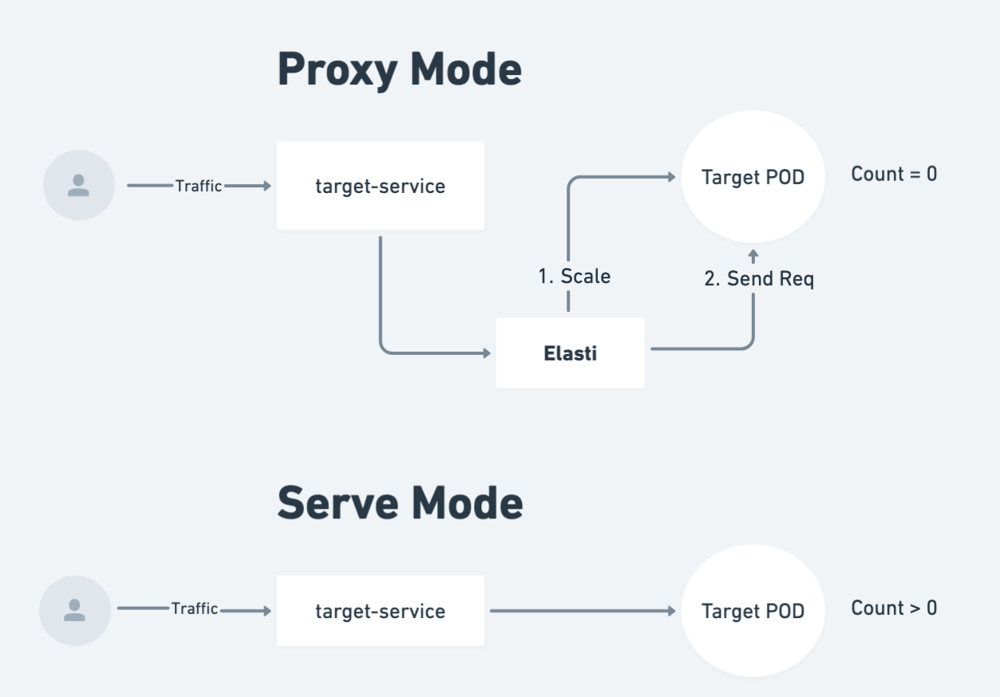

 
 

# Why use KubeElasti?

Kubernetes clusters can become costly, especially when running multiple services continuously. KubeElasti addresses this issue by giving you the confidence to scale down services during periods of low or no traffic, as it can bring them back up when demand increases. This optimization minimizes resource usage without compromising on service availability. Additionally, KubeElasti ensures reliability by acting as a proxy that queues incoming requests for scaled-down services. Once these services are reactivated, KubeElasti processes the queued requests, so that no request is lost. This combination of cost savings and dependable performance makes KubeElasti an invaluable tool for efficient Kubernetes service management.

> The name Elasti comes from a superhero "Elasti-Girl" from DC Comics. Her superpower is to expand or shrink her body at will—from hundreds of feet tall to mere inches in height. Kube just refers to kubernetes. Elasti powers in kubernetes! 

> KubeElasti(Sometimes referred to as just "Elasti").

# Contents

- [Why use KubeElasti?](#why-use-kubeelasti)
- [Contents](#contents)
- [Introduction](#introduction)
  - [Key Features](#key-features)
- [Getting Started](#getting-started)
- [Configure KubeElasti](#configure-kubeelasti)
- [Monitoring](#monitoring)
- [Development](#development)
- [Contribution](#contribution)
- [Getting Help](#getting-help)
- [Roadmap](#roadmap)
  - [Star History](#star-history)

# Introduction

KubeElasti is a Kubernetes-native solution that offers scale-to-zero functionality when there is no traffic and automatic scale up to 1 when traffic arrives. Most Kubernetes autoscaling solutions like HPA or Keda can scale from 1 to n replicas based on cpu utilization or memory usage. However, these solutions do not offer a way to scale to 0 when there is no traffic. KubeElasti solves this problem by dynamically managing service replicas based on real-time traffic conditions. It only handles scaling the application down to 0 replicas and scaling it back up to 1 replica when traffic is detected again. The scaling after 1 replica is handled by the autoscaler like HPA or Keda.

KubeElasti uses a proxy mechanism that queues and holds requests for scaled-down services, bringing them up only when needed. The proxy is used only when the service is scaled down to 0. When the service is scaled up to 1, the proxy is disabled and the requests are processed directly by the pods of the service.

## Key Features

- **Seamless Integration:** KubeElasti integrates effortlessly with your existing Kubernetes setup - whether you are using HPA or Keda. It takes just a few steps to enable scale to zero for any service.

- **Deployment and Argo Rollouts Support:** KubeElasti supports two scale target references: Deployment and Argo Rollouts, making it versatile for various deployment scenarios.

- **Prometheus Metrics Export:** KubeElasti exports Prometheus metrics for easy out-of-the-box monitoring. You can also import a pre-built dashboard into Grafana for comprehensive visualization.

- **Generic Service Support:** KubeElasti works at the kubernetes service level. It also supports East-West traffic using cluster-local service DNS, ensuring robust and flexible traffic management across your services. So any ingress or service mesh solution can be used with KubeElasti.

- **Autoscaler Integration:** KubeElasti can work seamlessly with [HPA](./docs/integrations.md#hpa) and [Keda](./docs/integrations.md#keda).

# Getting Started

Details on how to install and configure KubeElasti can be found in the [Getting Started](./docs/getting-started.md) guide.

# Configure KubeElasti

Check out the different ways to configure KubeElasti in the [Configuration](./docs/configure-elastiservice.md) guide.

# Monitoring

Monitoring details can be found in the [Monitoring](./docs/monitoring.md) guide.

# Development

Refer to [DEVELOPMENT.md](./DEVELOPMENT.md) for more details.

# Contribution

Contribution details can be found in the [Contribution](./CONTRIBUTING.md) guide.

# Getting Help

We have a dedicated [Discussions](https://github.com/truefoundry/KubeElasti/discussions) section for getting help and discussing ideas.

# Roadmap

We are maintaining the future roadmap using the [issues](https://github.com/truefoundry/KubeElasti/issues) and [milestones](https://github.com/truefoundry/KubeElasti/milestones). You can also suggest ideas and vote for them by adding a 👍 reaction to the issue.

## Star History

