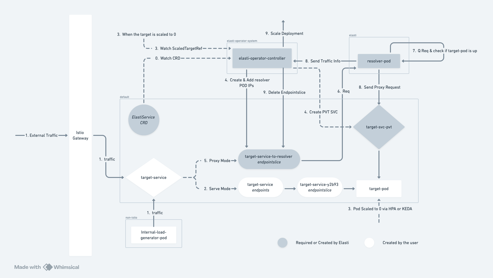

<p align="center">

</p>

<h1 align="center">Elasti</h1>
<h5 align="center">Serverless capabilities in Kubernetes :twisted_rightwards_arrows: :arrow_double_up:</h5>

<p align="center">
 <a>
    
 </a>
 <a>
    
 </a>
 <a>
    
 </a>

</p>


# Elasti

Elasti is a cloud-native tool to facilitate serverless capabilities within Kubernetes services. It intercepts and queues requests directed to a service that has been scaled down to zero instances, then scales the service up, and subsequently forwards the queued requests to the now active service.


>  The name Elasti comes from a superhero "Elasti-Girl" from DC Comics. Her supower is to expand or shrink her body at will—from hundreds of feet tall to mere inches in height. 



# Problem Statement
TBA

# Installation / Deployment on K8s

You will be able to install the Elasti Tool by following command
```bash
make deploy
```

After this, you can start creating elastiService, you can find a sample at `demo-elastiService.yaml`
Please use the exact format.

# Uninstallation 

For this, **you will need to remove all the CRDs first. **
Post that, just delete the install file. 
```bash
make undeploy
```

# Development

Here are the steps to deploy Elasti in your kubernetes cluster. 
For now, we will need to deploy the Elasti-Operator and Elasti-Resolver separately.

### Setup Docker

This is required to publish our docker images, and pull them inside our manifest files. 

1. Login to the docker hub via CLI.
```bash
docker login -u ramantehlan
# When asked for password, paste below text.
dckr_pat_WgMJEsO0nMNp10Bf7rLQ_FcVzLU
``` 

> That's it, now you will be able to push changes to images. Since the images are public, pulling it doesn't require any changes.

### Build Resolver

We will build and publish our resolver changes.

1. Go into resolver directory. 
2. Run build and publish command.
```bash
make docker-buildx IMG=ramantehlan/elasti-resolver:v1alpha1
```

### Build Operator

We will build and publish our Operator changes.

1. Go into operator directory.
2. Run build and publish command.
```bash
make docker-buildx IMG=ramantehlan/elasti-operator:v1alpha1
```

> Once your changes are published, you can re-deploy in your cluster.

# Configuration
TBA

# Playground 

```
 make docker-build docker-publish IMG=localhost:5001/elasti-operator:v1alpha1
 make docker-build docker-publish IMG=localhost:5001/elasti-resolver:v1alpha1
```

# Icon 

The icon is <a href="https://www.flaticon.com/free-icons/full-screen" title="full-screen icons">Full-screen icon created by Uniconlabs - Flaticon</a>. 


---

```
Get argo rollout type locally
kubectl apply -f https://github.com/argoproj/argo-rollouts/releases/latest/download/install.yaml

```


