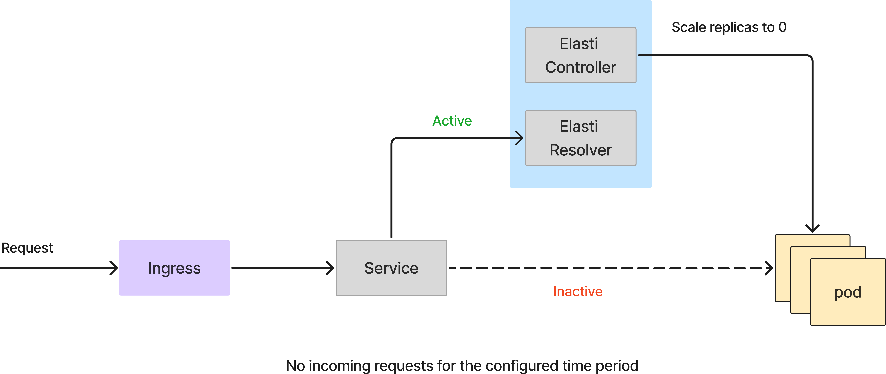
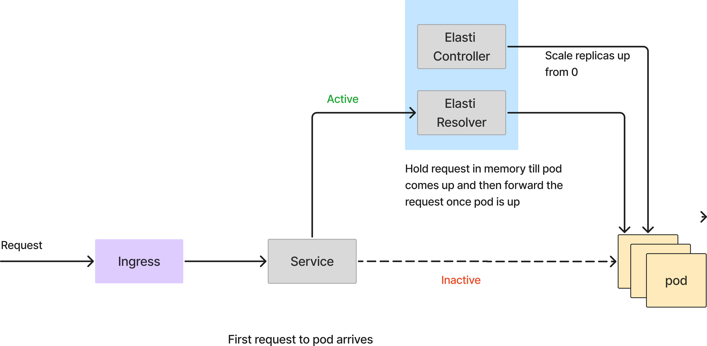
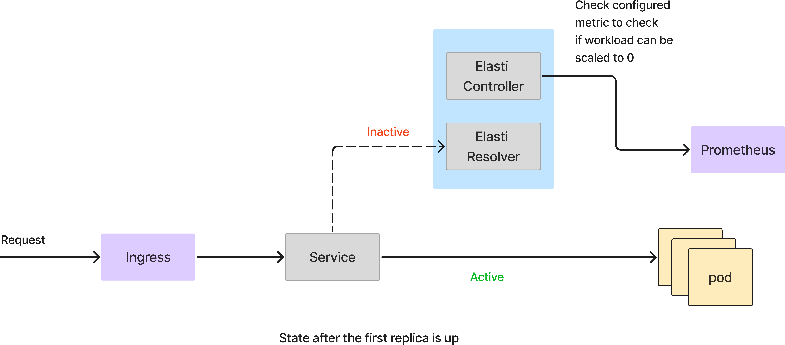

# Elasti Architecture


Elasti comprises of two main components: operator and resolver.

- **Controller**: A Kubernetes controller built using kubebuilder. It monitors ElastiService resources and scaled them to 0 or 1 as needed.
- **Resolver**: A service that intercepts incoming requests for scaled-down services, queues them, and notifies the elasti-controller to scale up the target service.

<div align="center">

</div>

<div align="center">

</div>

<div align="center">

</div>

<div align="center">

</div>


### Flow Description

- **[CRD Created]** The Operator fetches details from the CRD.
   1. Adds a finalizer to the CRD, ensuring it is only deleted by the Operator for proper cleanup.
   2. Fetches the `ScaleTargetRef` and initiates a watch on it.
   3. Adds the CRD details to a `crdDirectory`, caching the details of all CRDs.
- **[ScaleTargetRef Watch]** When a watch is added to the `ScaleTargetRef`:
   1. Identifies the kind of target and checks the available ready pods.
   2. If `replicas == 0` -> Switches to **Proxy Mode**.
   3. If `replicas > 0` -> Switches to **Serve Mode**.
   4. Currently, it supports only `deployments` and `rollouts`.

- **When pods scale to 0**

- **[Switch to Proxy Mode]**
   1. Creates a Private Service for the target service. This allows the resolver to reach the target pod, even when the public service has been modified, as described in the following steps.
   2. Creates a watch on the public service to monitor changes in ports or selectors.
   3. Creates a new `EndpointSlice` for the public service to redirect any traffic to the resolver.
   4. Creates a watch on the resolver to monitor the addition of new pods.

- **[In Proxy Mode]**
    1. Traffic reaching the target service, which has no pods, is sent to the resolver, capable of handling requests on all endpoints.
    2. [**In Resolver**]
       1. Once traffic hits the resolver, it reaches the `handleAnyRequest` handler.
       2. The host is extracted from the request. If it's a known host, the cache is retrieved from `hostManager`. If not, the service name is extracted from the host and saved in `hostManager`.
       3. The service name is used to identify the private service.
       4. Using `operatorRPC`, the controller is informed about the incoming request.
       5. The request is sent to the `throttler`, which queues the requests. It checks if the pods for the private service are up.
          1. If yes, a proxy request is made, and the response is sent back.
          2. If no, the request is re-enqueued, and the check is retried after a configurable time interval (set in the Helm values file).
       6. If the request is successful, traffic for this host is disabled temporarily (configurable). This prevents new incoming requests to the resolver, as the target is now verified to be up.
    3. [**In Controller/Operator**]
       1. ElastiServer processes requests from the resolver, containing the service experiencing traffic.
       2. Matches the service with the `crdDirectory` entry to retrieve the `ScaleTargetRef`, which is then used to scale the target.
       3. Evaluates triggers defined in the ElastiService:
           - If **any** trigger indicates that the service should be scaled up -> Scales to minTargetReplicas
       4. Once scaled up, switches to **Serve Mode**

- **When pods scale to 1**

- **[Switch to Serve Mode]**
    1. The Operator stops the informer/watch on the resolver.
    2. The Operator deletes the `EndpointSlice` pointing to the resolver.
    3. The system switches to **Serve Mode**.
- **[In Serve Mode]**
    1. Traffic hits the gateway, is routed to the target service, then to the target pod, and resolves the request.
    2. The Operator periodically evaluates triggers defined in the ElastiService.
    3. If **all** triggers indicate that the service is to be scaled down and cooldownPeriod has elapsed since last scale-up:
        - Scales down the target service to zero replicas
        - Switches to **Proxy Mode**


## 3. Controller

<div align="center">

</div>

## 4. Resolver

<div align="center">

</div>

## 5. Helm Values

Values you can pass to elastiResolver env.
```yaml

# HeaderForHost is the header to look for to get the host. X-Envoy-Decorator-Operation is the key for istio
headerForHost: X-Envoy-Decorator-Operation
# InitialCapacity is the initial capacity of the semaphore
initialCapacity: "500"
maxIdleProxyConns: "100"
maxIdleProxyConnsPerHost: "500"
# MaxQueueConcurrency is the maximum number of concurrent requests
maxQueueConcurrency: "100"
# OperatorRetryDuration is the duration for which we don't inform the operator
# about the traffic on the same host
operatorRetryDuration: "10"
# QueueRetryDuration is the duration after we retry the requests in queue
queueRetryDuration: "3"
# QueueSize is the size of the queue
queueSize: "50000"
# ReqTimeout is the timeout for each request
reqTimeout: "120"
# TrafficReEnableDuration is the duration for which the traffic is disabled for a host
# This is also duration for which we don't recheck readiness of the service
trafficReEnableDuration: "5"
```