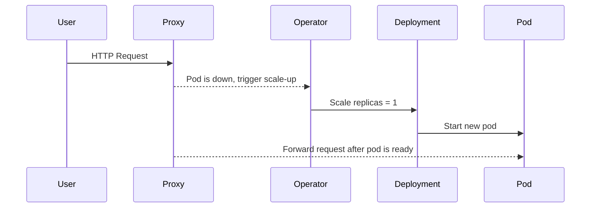
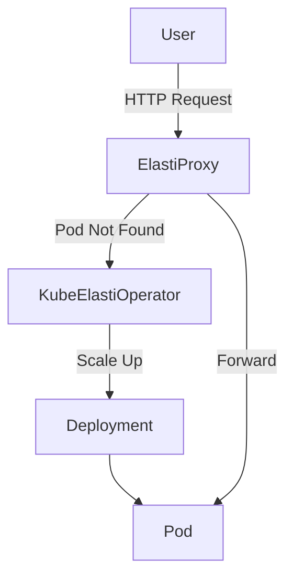

# Scale-to-Zero in Kubernetes: Save Costs Without Losing Traffic

If you've ever deployed HTTP services on Kubernetes, you've probably dealt with **idle pods** that burn resources during off-hours or inactivity. 

In today's blog, we dive into the concept of **Scale-to-Zero**, why it matters, how existing tools implement it (and where they fall short), and how [**KubeElasti**](https://github.com/truefoundry/KubeElasti) solves this problem with **zero rewrites, zero request loss**, and **zero lingering proxies**.

<!-- more -->

## What is Scale-to-Zero?

**Scale-to-Zero** refers to the ability to automatically scale down a deployment to zero replicas — effectively **turning off** the service — when it's idle, and scaling it back up when traffic resumes.

This is ideal for:

- Internal or development environments
- Spiky workloads
- Scheduled batch jobs
- Cost-sensitive services (e.g., licensed software, GPU workloads)

## Why Use Scale-to-Zero?

There are many reasons to use scale-to-zero:

- **Cost savings**: You're always paying for at least one pod
- **Cold-start savings**: Cold-start savings are left on the table
- **Infrequently accessed services**: Infrequently accessed services still waste memory and CPU

Scale-to-Zero solves this by **removing the pod** entirely. But... it comes with a catch: if traffic arrives and no pod is running, you'll get a **503 error** unless something handles the scale-up _and_ request buffering.

## Scale-to-Zero: Architectural View

Here's how a scale-to-zero system typically works:

### Challenges

* Traffic can arrive **before** the pod is ready.
* The request may **time out** unless it's **queued**.
* Proxy needs to **exit the path** once pod is alive (for performance).

## How KubeElasti Solves Scale-to-Zero

[**KubeElasti**](https://github.com/truefoundry/KubeElasti) is a **Kubernetes-native controller + proxy** that adds scale-to-zero to **your existing HTTP services** — without any rewrites, packaging changes, or vendor lock-in.

### How it works:

1. **Idle Timeout**: If your service sees no traffic for N minutes, the KubeElasti operator **scales it to 0**.
2. **Proxy Intercept**: If traffic hits a downed service, the lightweight **Elasti proxy queues** the request.
3. **Scale-Up Trigger**: The operator is notified and scales the pod up (via HPA, KEDA, or native scaling).
4. **Traffic Replay**: Once the pod is ready, the proxy **forwards the request** and exits the path.

## What Makes KubeElasti Different?

Unlike Knative, KEDA, or OpenFaaS — which require new runtimes, complex setups, or stay in the path — **KubeElasti is minimal and transparent.**

### Feature Comparison

| Feature                      | **KubeElasti** | Knative           | OpenFaaS  | KEDA HTTP Add-on  |
| ---------------------------- | -------------- | ----------------- | --------- | ----------------- |
| Scale to Zero                | ✅              | ✅                 | ✅         | ✅                 |
| Works with Existing Services | ✅              | ❌                 | ❌         | ✅                 |
| Request Queueing             | ✅ (exits path) | ✅ (stays in path) | ✅         | ✅ (stays in path) |
| Resource Footprint           | 🟢 Low         | 🔺 High           | 🔹 Medium | 🟢 Low            |
| Setup Complexity             | 🟢 Low         | 🔺 High           | 🔹 Medium | 🔹 Medium         |

## Trade-offs and Limitations

Like any focused tool, KubeElasti makes some trade-offs:

* ✅ HTTP-only support (for now) — gRPC/TCP support is in roadmap.
* ✅ Only Prometheus metrics are supported for traffic detection.
* ✅ Works with **Deployments & Argo Rollouts** — more types to come.

That said, it gives you **production-ready scale-to-zero** in under 5 minutes, with real observability and battle-tested scaling behavior.

## Final Thoughts

Scale-to-Zero is no longer a "nice-to-have" — it's a **cost-saving, resilience-enhancing pattern** for modern infrastructure.

With KubeElasti, you can implement it **without changing your service code**, **without managing extra FaaS platforms**, and **without request failures**.

Want to give it a spin? Start here:

* 🧪 Quickstart: [Get Started Guide](/src/gs-setup/)
* 🧩 Source Code: [KubeElasti on GitHub](https://github.com/truefoundry/KubeElasti)

