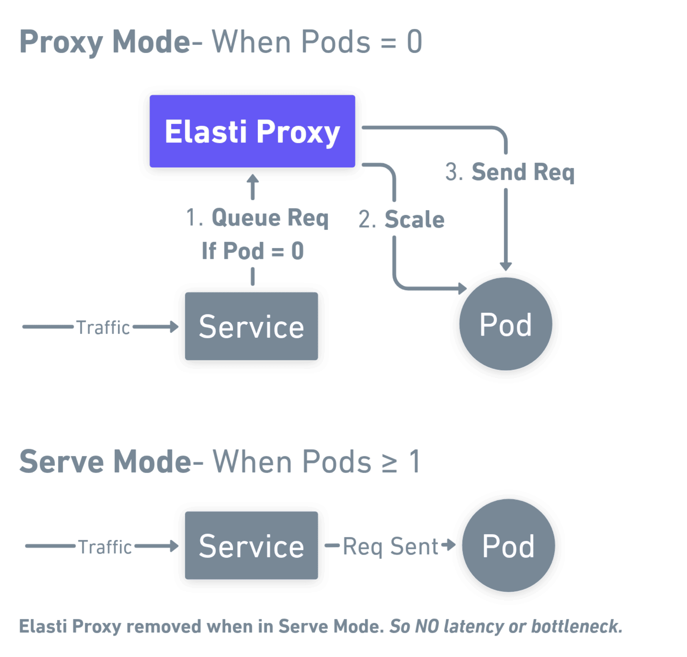

# Introduction

KubeElasti(Sometimes referred to as just "Elasti") is a Kubernetes-native solution that offers scale-to-zero functionality when there is no traffic and automatic scale up to 0 when traffic arrives. Most Kubernetes autoscaling solutions like HPA or Keda can scale from 1 to n replicas based on cpu utilization or memory usage. However, these solutions do not offer a way to scale to 0 when there is no traffic. KubeElasti solves this problem by dynamically managing service replicas based on real-time traffic conditions. It only handles scaling the application down to 0 replicas and scaling it back up to 1 replica when traffic is detected again. The scaling after 1 replica is handled by the autoscaler like HPA or Keda.

> The name Elasti comes from a superhero "Elasti-Girl" from DC Comics. Her superpower is to expand or shrink her body at will—from hundreds of feet tall to mere inches in height. Kube just refers to kubernetes. Elasti powers in kubernetes! 

KubeElasti uses a proxy mechanism that queues and holds requests for scaled-down services, bringing them up only when needed. The proxy is used only when the service is scaled down to 0. When the service is scaled up to 1, the proxy is disabled and the requests are processed directly by the pods of the service.

## How It Works

KubeElasti continuously monitors an ElastiService by evaluating a set of custom triggers defined in its configuration. These triggers represent various conditions—such as traffic metrics or other custom signals—that determine whether a service should be active or scaled down.

- **Scaling Down:**  
  When **all** triggers indicate inactivity or low demand, KubeElasti scales the target service down to 0 replicas. During this period, KubeElasti switches into **proxy mode** and queues incoming requests instead of dropping them.

- **Traffic Queueing in Proxy Mode:**  
  In Proxy Mode, KubeElasti intercepts and queues incoming requests directed at the scaled-down service. This ensures that no request is lost, even when the service is scaled down to 0.

- **Scaling Up:**  
  If **any** trigger signals a need for activity, KubeElasti immediately scales the service back up to its minimum replicas. As the service comes online, KubeElasti switches to **Serve Mode**.

- **Serve Mode:**  
  In Serve Mode, the active service handles all incoming traffic directly. Meanwhile, any queued requests accumulated during Proxy Mode are processed, ensuring a seamless return to full operational capacity.

This allows KubeElasti to optimize resource consumption by scaling services down when unneeded, while its request queueing mechanism preserves user interactions and guarantees prompt service availability when conditions change.

## Key Features

- **Seamless Integration:** KubeElasti integrates effortlessly with your existing Kubernetes setup - whether you are using HPA or Keda. It takes just a few steps to enable scale to zero for any service.

- **Deployment and Argo Rollouts Support:** KubeElasti supports two scale target references: Deployment and Argo Rollouts, making it versatile for various deployment scenarios.

- **Prometheus Metrics Export:** KubeElasti exports Prometheus metrics for easy out-of-the-box monitoring. You can also import a pre-built dashboard into Grafana for comprehensive visualization.

- **Generic Service Support:** KubeElasti works at the kubernetes service level. It also supports East-West traffic using cluster-local service DNS, ensuring robust and flexible traffic management across your services. So any ingress or service mesh solution can be used with KubeElasti.

## Limitations

- **Only HTTP is supported:** KubeElasti currently supports requests that are routed to the service via HTTP. In the future we will support more protocols like TCP, UDP etc.
- **Only Deployment and Argo Rollouts are supported:** KubeElasti supports two scale target references: Deployment and Argo Rollouts. In the future this will be made generic to support all target references that support the `/scale` subresource.
- **Prometheus Trigger:** The only trigger currently supported is Prometheus

Please checkout the comparison [here](comparisons.md) to see how KubeElasti compares to other Kubernetes autoscaling solutions.
