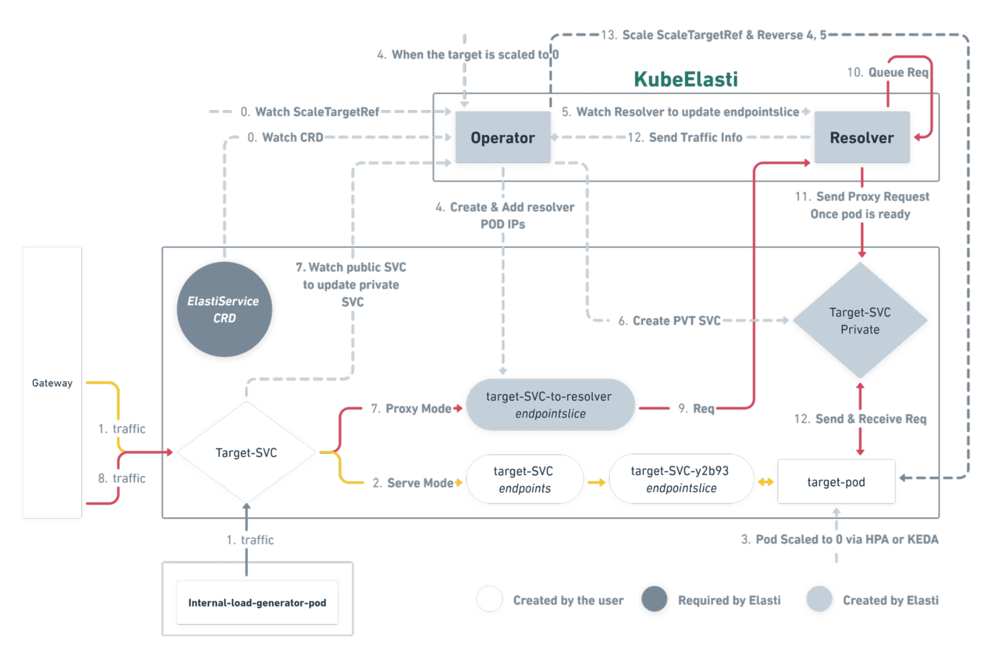
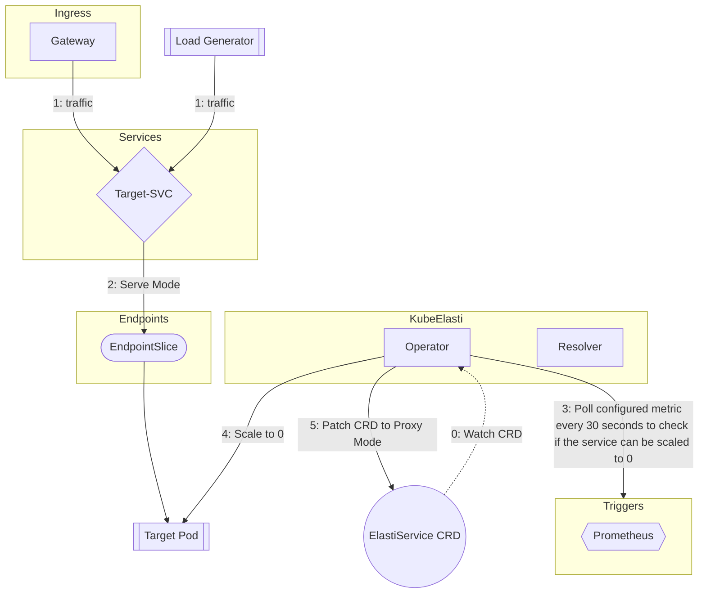
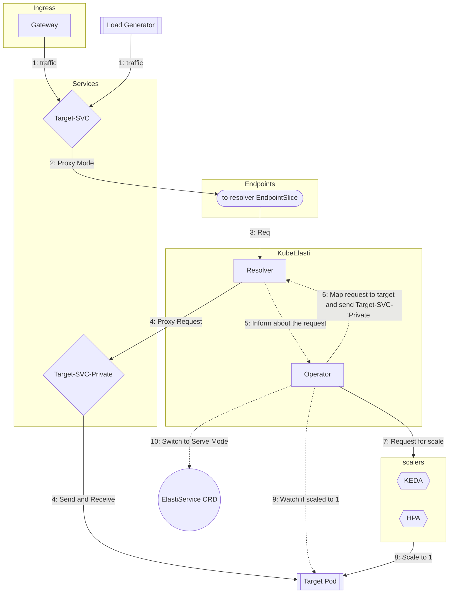

# KubeElasti Architecture

KubeElasti comprises two main components: operator and resolver.

- **Controller/Operator**: A Kubernetes controller built using kubebuilder. It monitors ElastiService resources and scales them to 0 or 1 as needed.

- **Resolver**: A service that intercepts incoming requests for scaled-down services, queues them, and notifies the elasti-controller to scale up the target service.

## Architecture [Serve Mode]

## Architecture [Proxy Mode]

