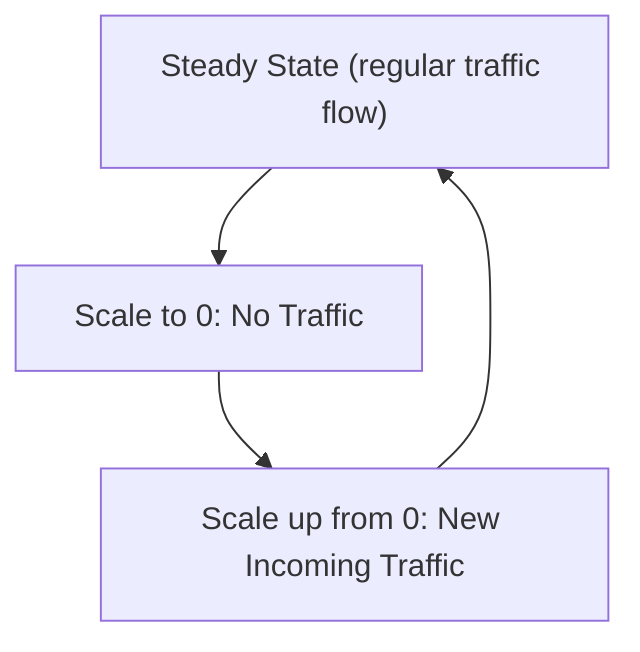
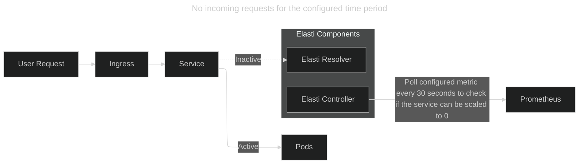
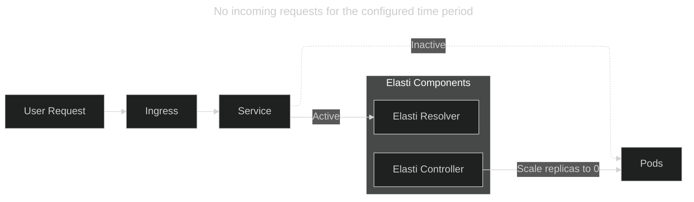
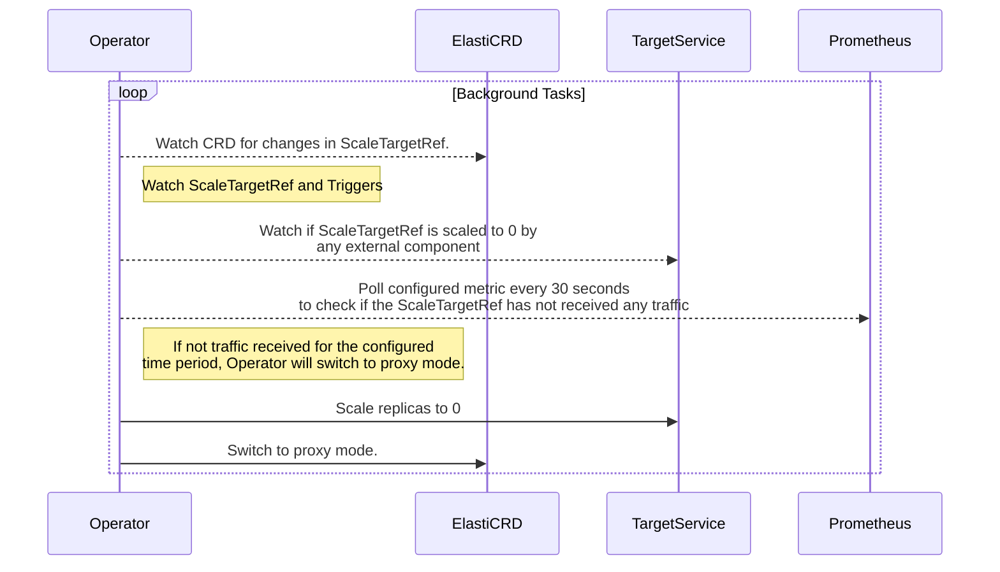
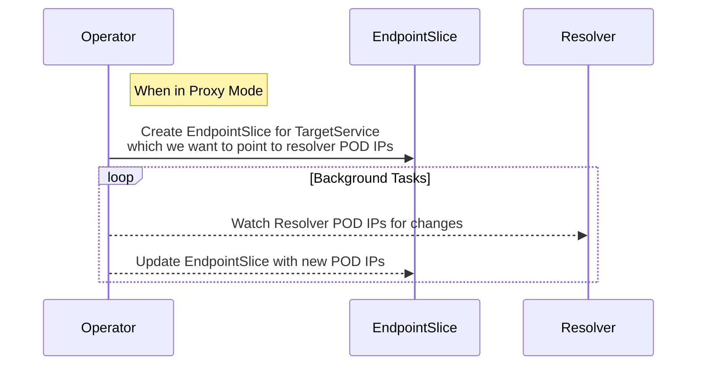
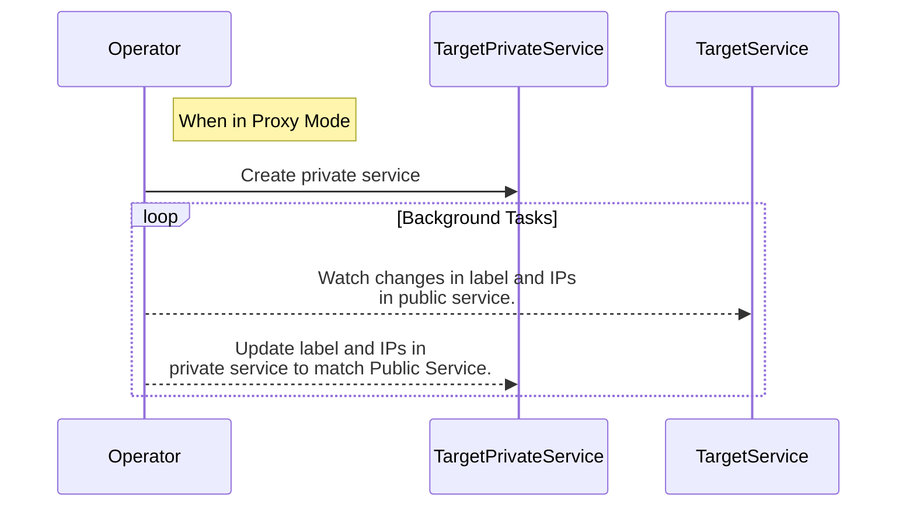
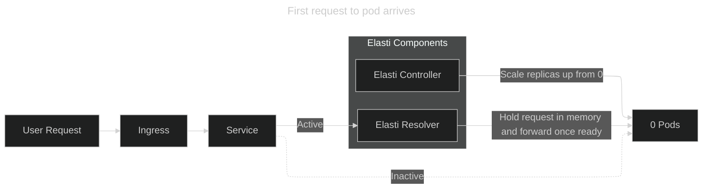
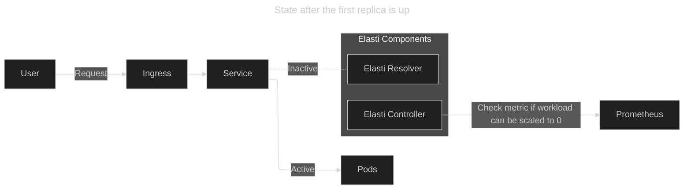
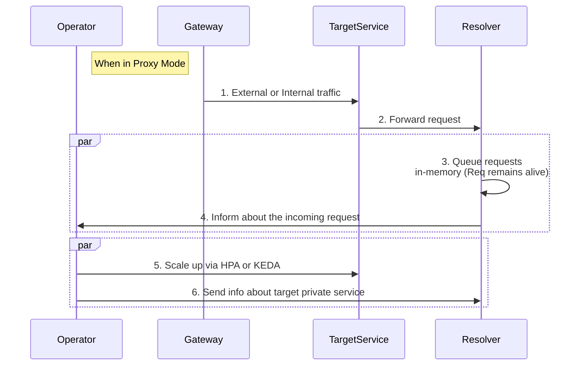
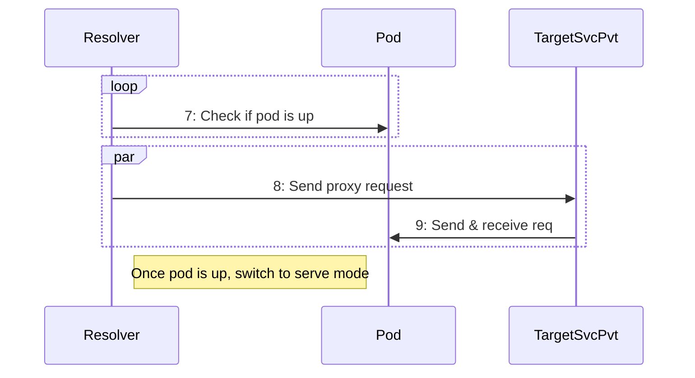

# **Flow Description**

When we enable KubeElasti on a service, the service operates in 3 modes:

1. **Steady State**: The service is receiving traffic and doesn't need to be scaled down to 0.
2. **Scale Down to 0**: The service hasn't received any traffic for the configured duration and can be scaled down to 0.
3. **Scale up from 0**: The service receives traffic again and can be scaled up to the configured minTargetReplicas.
   

## **1. Steady State:** Flow of requests to service

In this mode, all requests are handled directly by the service pods; the KubeElasti **resolver** is not involved. The KubeElasti controller continually polls Prometheus with the configured query and checks the result against the threshold value to decide whether the service can be scaled down.

## **2. Scale Down to 0:** when there are no requests

If the query from prometheus returns a value less than the threshold, KubeElasti will scale down the service to 0. Before it scales to 0, it redirects all requests to the KubeElasti resolver, then sets the rollout/deployment replicas to 0. It also pauses KEDA (if in use) to prevent it from scaling the service up, because KEDA is configured with `minReplicas: 1`.

### How it works? 

#### 1. Switching to Proxy Mode

This is how we decide to switch to proxy mode.

#### 2. Redirecting requests to resolver
This is how we redirect requests to resolver.

#### 3. Sync Private Service to Public Service
This is how we send traffic to target pod, even if the public service is pointing to resolver. We create a Private Service, as in Proxy Mode, we redirect the traffic to Resolver,   so we need to point the public service to resolver POD IPs.

## **3. Scale up from 0:** when the first request arrives

Since the service is scaled down to 0, all requests will hit the KubeElasti resolver. When the first request arrives, KubeElasti will scale up the service to the configured minTargetReplicas. It then resumes Keda to continue autoscaling in case there is a sudden burst of requests. It also changes the service to point to the actual service pods once the pod is up. Requests reaching the KubeElasti resolver are retried for up to five minutes before a response is returned to the client. If the pod takes more than 5 mins to come up, the request is dropped.

### How it works? 

#### 1. Bring the pod up

#### 2. Resolving queued requests

