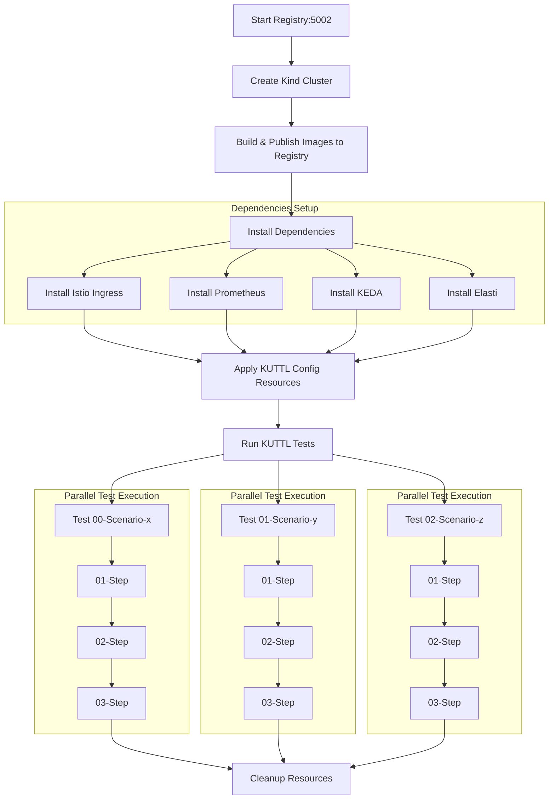
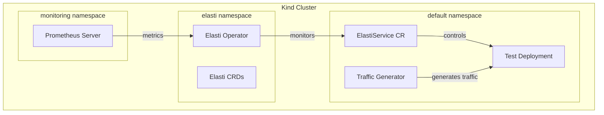

# End-to-End Testing

Use the KUTTL framework to execute Elasti's end-to-end tests in a real Kubernetes environment:

```bash
cd ./tests/e2e
make setup   # Sets up environment
make test    # Runs tests
```

For detailed information about the E2E test framework, see [tests/e2e/README.md](https://github.com/truefoundry/KubeElasti/blob/main/tests/e2e/README.md).

## Testing Flow

The E2E testing pipeline follows these detailed steps:

1. **Registry Setup**
    1. A Docker registry is started on `port 5002`
    2. This registry will store the locally built operator and resolver images

2. **Kind Cluster Creation**
    1. A Kind cluster is created using the configuration in `kind-config.yaml`
    2. The registry is connected to the Kind network to allow image pulling


3. **Image Building and Publishing**
    1. Elasti operator and resolver images are built from source
    2. Images are tagged and pushed to the local registry

4. **Dependency Installation**
    1. **Istio Ingress**: Sets up the ingress gateway for routing external traffic
    2. **Prometheus**: Installed for metrics collection (without Grafana to reduce overhead)
    3. **KEDA**: Installed for event-driven autoscaling capabilities
    4. **Elasti**: The operator and CRDs are installed using Helm

5. **Test Initialization**
    1. Persistent, lightweight resources are applied via the `kuttl-test.yaml` config
    2. These resources are shared across all test cases

6. **Test Execution**
    1. Tests are executed in order based on their numerical prefix
    2. Each folder in the `tests/` directory represents an independent test
    3. Each file within a test folder represents steps of that test
    4. Tests can run in parallel if enabled, with no cross-dependencies between test folders

7. **Test Cleanup**
    1. Resources are cleaned up after each test completes




## Test configuration

The test configuration is defined in the `kuttl-test.yaml` file.
There is a `timeout` field in the `kuttl-test.yaml` file, which is set to 30s by default. This is the timeout for each test step.

## Testing Environment

The testing environment consists of:



## Adding New Tests

To add a new test scenario:

1. Create a new directory in the `tests/e2e/tests/` directory following the KUTTL format, `<number>-<test-name>`.
2. Define test steps with commands and assertions, in the directory using `<number>-<step-name>.yaml` format.
3. Add any supporting files or manifests needed
4. To run the test individually, use:
   ```bash
   make test T=<number>-<test-name>
   ```

## KUTTL Test Files Structure

KUTTL tests follow a specific structure:

```bash
tests/
└── 00-elasti-setup/            # Test case (folder named with numbered prefix)
    ├── 00-apply.yaml           # First step - apply resources, created the required scenario.
    ├── 01-wait.yaml            # Second step - wait for resources to be ready.
    └── 02-assert.yaml          # Third step - assertion
```

- **Each directory represents an individual test** (This number doesn't determine order, that works only for steps inside the directory)
- Each file within a test directory **represents a step in that test**
- Steps follow naming convention with prefix 00-, 01-, etc. for execution ordering
    - For example, `00-assert.yaml` is the first step in the test, `01-apply.yaml` is the second step, and so on.
    - Same doesn't apply for folders in `tests/e2e/tests/` directory. We still follow the same naming for them just to keep it consistent.

### Run Single Test

```bash
make test T=00-elasti-setup
```

### Example Test Structure

```yaml
# Test step to assert elasti operator, resolver and target deployment are running, and if elasti service is in serve mode.
apiVersion: apps/v1
kind: Deployment
metadata:
  name: elasti-operator-controller-manager
  namespace: elasti
status:
  readyReplicas: 1
---
apiVersion: apps/v1
kind: Deployment
metadata:
  name: elasti-resolver
  namespace: elasti
status:
  readyReplicas: 1
---
apiVersion: apps/v1
kind: Deployment
metadata:
  name: target-deployment
  namespace: default
status:
  readyReplicas: 1
---
apiVersion: elasti.truefoundry.com/v1alpha1
kind: ElastiService
metadata:
  name: target-elastiservice
  namespace: default
status:
  mode: serve
```

!!! tip 
    Refer to [Kuttle Docs](https://kuttl.dev/docs/testing/steps.html#format) for more information.

## Tips for Writing KUTTL Tests

1. **Naming Convention**: Use numerical prefixes within test folders to know the sequence of test cases and files to control execution of the steps.
2. **Avoid Cross-Dependencies**: Each test folder should be independent of others
3. **Use Timeouts Wisely**: Set appropriate timeouts for operations that may take time
4. **Resource Sharing**: Put shared resources in `kuttl-test.yaml` commands section
5. **Debugging**: Use `kubectl kuttl test --debug` for verbose output during test development
