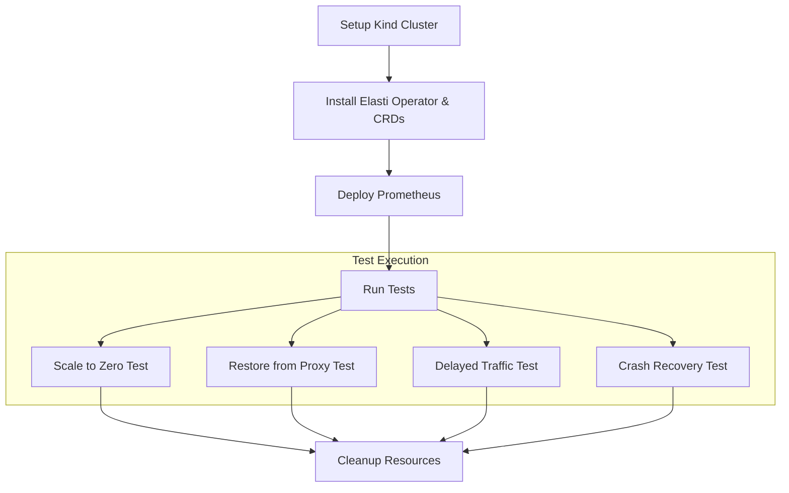
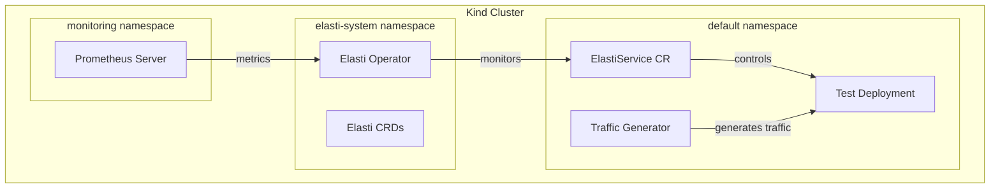

# Elasti E2E Testing Framework

This directory contains an End-to-End (E2E) testing framework for the Elasti Kubernetes operator system using KUTTL (KUbernetes Test TooL). The framework provides a comprehensive way to validate Elasti's core functionality in a realistic Kubernetes environment.

## Overview

Elasti is a Kubernetes operator-based system that:
- Provides a custom CRD `ElastiService` 
- Automatically scales workloads to zero after an idle period using Prometheus metrics
- Supports "Serve Mode" (direct traffic to app) and "Proxy Mode" (traffic goes through the Resolver)
- Includes sophisticated Prometheus integration to prevent false scale-down due to scrape delays

This testing framework validates these capabilities through automated YAML-based tests.

## Test Scenarios

The framework includes the following test scenarios:

1. **Scale to Zero (`scale-to-zero_test.yaml`)**:
   - Verifies that workload scales to 0 replicas after the idle window duration
   - Validates that the ElastiService correctly identifies and scales down idle deployments

2. **Restore from Proxy (`restore-from-proxy_test.yaml`)**:
   - Tests scaling from 0 when a request comes through the Resolver
   - Validates that the proxy mode correctly triggers scale-up from zero

3. **Delayed Traffic (`delayed-traffic_test.yaml`)**:
   - Tests the system's response to traffic arriving after scaling to zero
   - Confirms that the system properly scales up when traffic resumes

4. **Crash Recovery (`crash-recovery_test.yaml`)**:
   - Tests system resilience when the operator crashes and recovers
   - Ensures that the system returns to proper functionality after disruption

## Test Workflow

Each test follows this general pattern:

1. Setup the test environment (deploy test app and ElastiService)
2. Verify initial conditions
3. Trigger the scenario under test
4. Verify expected behavior
5. Clean up resources



## Testing Environment

The testing environment consists of:



## Requirements

### System Requirements

- Docker (for Kind)
- Kubernetes (for kubectl)
- Go 1.20+
- Make

### Tools

- [Kind](https://kind.sigs.k8s.io/) (Kubernetes in Docker) v0.17.0+
- [kubectl](https://kubernetes.io/docs/tasks/tools/) v1.25.0+
- [kuttl](https://kuttl.dev/) v0.15.0+

### Development Environment

- Linux, macOS, or WSL2 on Windows
- At least 4GB of free memory for the Kind cluster
- At least 10GB of free disk space

## Project Structure

```
elasti/e2e/
├── tests/                     # KUTTL test definitions
│   ├── scale-to-zero_test.yaml
│   ├── restore-from-proxy_test.yaml
│   ├── delayed-traffic_test.yaml
│   ├── crash-recovery_test.yaml
├── kind-config.yaml           # Kind cluster configuration
├── deploy-prometheus.yaml     # Prometheus deployment manifest
├── test-deployment.yaml       # Test deployment manifest
├── test-elastiservice.yaml    # ElastiService CR manifest
├── traffic-job.yaml           # Traffic generator job
├── Makefile                   # Test automation commands
└── README.md                  # This file
```

## Running the Tests

### Quick Start

To run the complete test suite:

```bash
cd e2e
make all
```

This will:
1. Create a Kind cluster
2. Install the Elasti operator and CRDs
3. Deploy Prometheus
4. Run all KUTTL tests
5. Show the test results

### Individual Commands

You can also run specific parts of the testing process:

```bash
# Create the Kind cluster
make kind-up

# Install dependencies (Elasti & Prometheus)
make apply-deps

# Run the E2E tests
make e2e-test

# Generate traffic (if needed for manual testing)
make traffic

# Delete the cluster when done
make kind-down

# Clean up resources but keep the cluster
make clean
```

### Verifying Specific Scaling

To manually verify that a deployment has the expected number of replicas:

```bash
make verify-scale REPLICAS=<expected_count>
```

## Test Details

### Scale to Zero Test

This test verifies that Elasti correctly scales a deployment to zero after the idle window has passed:

1. Apply a test deployment
2. Apply an ElastiService CR targeting the deployment
3. Wait for the idle window to pass (configurable, default: 2m)
4. Verify the deployment scales to 0 replicas

### Restore from Proxy Test

This test validates that Elasti correctly scales up a deployment when traffic arrives via the resolver proxy:

1. Apply test deployment and ElastiService
2. Wait for scale to zero
3. Send a test request to the ElastiService
4. Verify the deployment scales back to 1 replica

### Delayed Traffic Test

This test checks Elasti's behavior when traffic appears after scaling to zero:

1. Apply test deployment and ElastiService
2. Wait for scale to zero
3. Apply a traffic generator job
4. Verify deployment scales to 1 replica
5. Wait for traffic to complete

### Crash Recovery Test

This test ensures Elasti's resilience after the operator crashes:

1. Apply test deployment and ElastiService
2. Force delete the operator pod
3. Wait for the operator to restart
4. Verify ElastiService functionality still works

## Troubleshooting

### Common Issues

1. **Tests Timeout**: The default timeouts might need adjustment depending on your system's performance.

2. **Prometheus Connection**: If tests fail due to metric collection, check if Prometheus is accessible:
   ```bash
   kubectl -n monitoring port-forward svc/prometheus-server 9090:9090
   ```
   Then visit http://localhost:9090 in your browser.

3. **Resource Constraints**: If your system is running low on resources, try:
   ```bash
   make kind-down
   docker system prune
   make kind-up
   ```

## Adding New Tests

To add a new test scenario:

1. Create a new YAML file in the `tests/` directory following the KUTTL format
2. Define test steps with commands and assertions
3. Add any supporting files or manifests needed
4. Run the test individually with:
   ```bash
   kuttl test --start-kind=false --namespace=default ./tests/your-new-test.yaml
   ```
