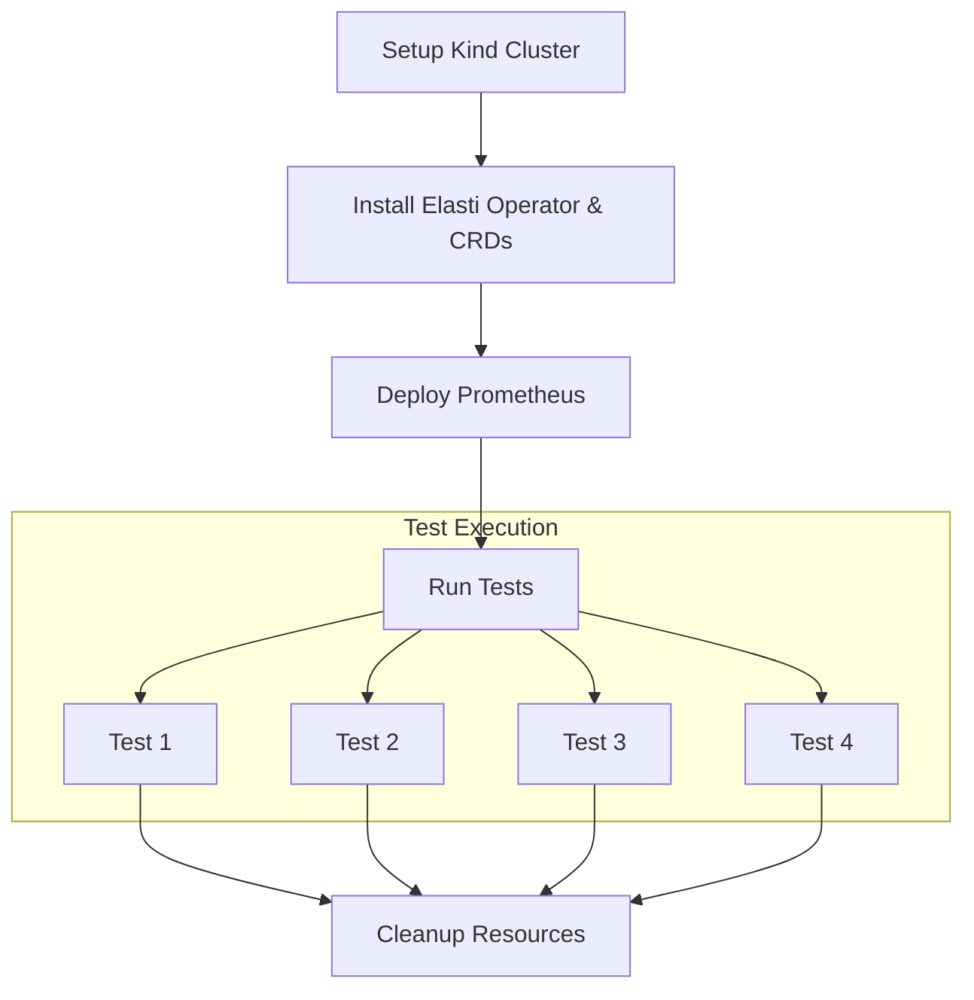
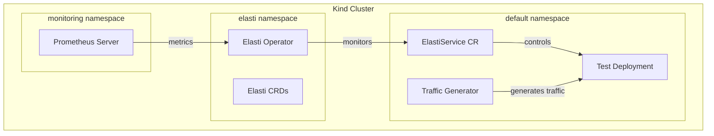

# Elasti E2E Testing Framework

This directory contains an End-to-End (E2E) testing framework for the Elasti Kubernetes operator system using KUTTL (KUbernetes Test TooL). The framework provides a comprehensive way to validate Elasti's core functionality in a realistic Kubernetes environment.

## Test Scenarios

The framework includes the following test scenarios:

### E2E Test Timeline

| Task                                     | Status | Target Date | Completed Date | Est. Time | Notes                                |
|-----------------------------------------|--------|-------------|----------------|----------|--------------------------------------|
| Test it on GitHub Actions                | TODO   |             |                | 1-2 days | Set up CI workflow for e2e tests     |
| Add Istio/nginx gateway in Kind setup    | TODO   |             |                | 0.5-1 days | Configure ingress for testing        |
| Implement Test Scenarios                 | TODO   |             |                | 2 days   | See details below                    |

### Test Scenario 1: Switch to Proxy Mode

| Step                                    | Status | Est. Time | Description                                             |
|-----------------------------------------|--------|----------|---------------------------------------------------------|
| Read ElastiService                      | TODO   | 1-2 hour   | Initialize test with ElastiService configuration        |
| Check for private service               | TODO   | 1-2 hour   | Verify private service specs match public service       |
| Endpoint Slice to Resolver              | TODO   | 1-2 hour   | Confirm endpoint slice is correctly sent to resolver    |

### Test Scenario 2: Request Coming in Proxy Mode

| Step                                    | Status | Est. Time | Description                                             |
|-----------------------------------------|--------|----------|---------------------------------------------------------|
| Send a dummy request                    | TODO   | 1-2 hour   | Send test traffic to the service in proxy mode          |
| Wait for processing                     | TODO   | 1-2 hour   | Allow system time to process request                    |
| Verify K8s events                       | TODO   | 1-2 hour   | Check that appropriate K8s events are generated         |

### Test Scenario 3: Switch to Serve Mode

| Step                                    | Status | Est. Time | Description                                             |
|-----------------------------------------|--------|----------|---------------------------------------------------------|
| Send a dummy request                    | TODO   | 1-2 hour   | Send test traffic to trigger serve mode                 |
| Wait for processing                     | TODO   | 1-2 hour   | Allow system time to process mode switch                |
| Verify endpoint is removed              | TODO   | 1-2 hour   | Confirm endpoint is properly removed after switch       |

# Total Estimated Time: 3-4 Days

- Things which are less likeyly to change and are heavy, put them in makefile
- Things which are light weight, and more likely to change, but them in kuttle-config.yaml

## Test Workflow

Each test follows this general pattern:

1. Setup the test environment (deploy test app and ElastiService)
2. Verify initial conditions
3. Trigger the scenario under test
4. Verify expected behavior
5. Clean up resources



## Testing Environment

The testing environment consists of:



## Requirements

### System Requirements

- Docker (for Kind)
- Kubernetes (for kubectl)
- Go 1.20+
- Make

### Tools

- [Kind](https://kind.sigs.k8s.io/) (Kubernetes in Docker) v0.17.0+
- [kubectl](https://kubernetes.io/docs/tasks/tools/) v1.25.0+
- [kuttl](https://kuttl.dev/) v0.15.0+

### Development Environment

- Linux, macOS, or WSL2 on Windows
- At least 4GB of free memory for the Kind cluster
- At least 10GB of free disk space

## Project Structure

```
elasti/tests/e2e/
├── tests/                     # KUTTL test definitions
├── setup/
│   ├── kind-config.yaml           # Kind cluster 
│   ├── deploy-prometheus.yaml     # Prometheus deployment
│   ├── dummy-deployment.yaml       # Test deployment manifest
│   ├── dummy-elastiservice.yaml    # ElastiService CR manifest
│   ├── elasti-chart-values.yaml    # Elasti chart values.yaml
│   └── traffic-job.yaml           # Traffic generator job
├── Makefile                   # Test automation commands
├── kuttl-test.yaml            # KUTTL test suite
└── README.md                  # This file
```

## Running the Tests

### Quick Start

To run the complete test suite:

```bash
make all
```

This will:
1. Create a Kind cluster
2. Install the Elasti operator and CRDs
3. Deploy Prometheus
4. Run all KUTTL tests
5. Show the test results

### Individual Commands

You can also run specific parts of the testing process:

```bash
# Create the Kind cluster
make kind-up

# Install dependencies (Elasti & Prometheus)
make apply-deps

# Run the E2E tests
make e2e-test

# Generate traffic (if needed for manual testing)
make traffic

# Delete the cluster when done
make kind-down

# Clean up resources but keep the cluster
make clean
```

### Verifying Specific Scaling

To manually verify that a deployment has the expected number of replicas:

```bash
make verify-scale REPLICAS=<expected_count>
```

## Test Details

### Scale to Zero Test

This test verifies that Elasti correctly scales a deployment to zero after the idle window has passed:

1. Apply a test deployment
2. Apply an ElastiService CR targeting the deployment
3. Wait for the idle window to pass (configurable, default: 2m)
4. Verify the deployment scales to 0 replicas

### Restore from Proxy Test

This test validates that Elasti correctly scales up a deployment when traffic arrives via the resolver proxy:

1. Apply test deployment and ElastiService
2. Wait for scale to zero
3. Send a test request to the ElastiService
4. Verify the deployment scales back to 1 replica

### Delayed Traffic Test

This test checks Elasti's behavior when traffic appears after scaling to zero:

1. Apply test deployment and ElastiService
2. Wait for scale to zero
3. Apply a traffic generator job
4. Verify deployment scales to 1 replica
5. Wait for traffic to complete

### Crash Recovery Test

This test ensures Elasti's resilience after the operator crashes:

1. Apply test deployment and ElastiService
2. Force delete the operator pod
3. Wait for the operator to restart
4. Verify ElastiService functionality still works

## Troubleshooting

### Common Issues

1. **Tests Timeout**: The default timeouts might need adjustment depending on your system's performance.

2. **Prometheus Connection**: If tests fail due to metric collection, check if Prometheus is accessible:
   ```bash
   kubectl -n monitoring port-forward svc/prometheus-server 9090:9090
   ```
   Then visit http://localhost:9090 in your browser.

3. **Resource Constraints**: If your system is running low on resources, try:
   ```bash
   make kind-down
   docker system prune
   make kind-up
   ```

## Adding New Tests

To add a new test scenario:

1. Create a new YAML file in the `tests/` directory following the KUTTL format
2. Define test steps with commands and assertions
3. Add any supporting files or manifests needed
4. Run the test individually with:
   ```bash
   kuttl test --start-kind=false --namespace=default ./tests/your-new-test.yaml
   ```

```bash
krew install kuttl
```


```
# Test Swtich to Proxy mode 

Read EalstiService
---
Check for prviate service 
- Spec are same as public svc 
---  
Endpoint Slice to Resolver 
--- 


# Test Request coming in Proxy Mode 

Send a dummy request 
---
Wait  
---
k8s events 


# Test switch to Serve mode 

Send a dummy request 
---
Wait  
---
Endpoint is remove 
--- 

```


