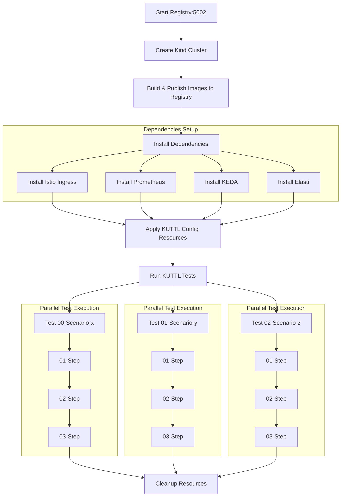
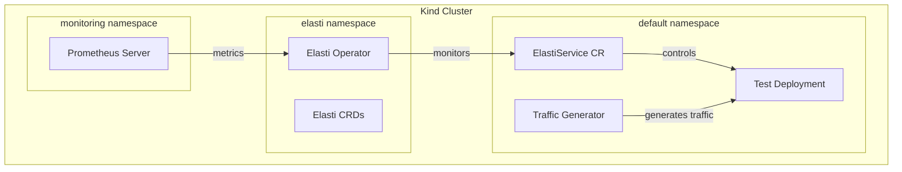

# Elasti E2E Testing Framework

This directory contains an End-to-End (E2E) testing framework for the Elasti Kubernetes operator system using KUTTL (KUbernetes Test TooL). The framework provides a comprehensive way to validate Elasti's core functionality in a realistic Kubernetes environment.

## Requirements

### System Requirements

- Docker (for Kind)
- Go 1.20+
- Make

### Tools

- [Kind](https://kind.sigs.k8s.io/) (Kubernetes in Docker) v0.17.0+
- [kubectl](https://kubernetes.io/docs/tasks/tools/) v1.25.0+
- [kuttl](https://kuttl.dev/) v0.15.0+
  ```bash
    # Using Krew (Kubernetes plugin manager)
    kubectl krew install kuttl

    # Or using Go
    go install github.com/kudobuilder/kuttl/cmd/kubectl-kuttl@latest
   ```

### Development Environment

- Linux, macOS, or WSL2 on Windows
- At least 4GB of free memory for the Kind cluster
- At least 10GB of free disk space


## Directory Structure

The E2E testing framework is organized into the following directories:


```
elasti/tests/e2e/
├── tests/                     # KUTTL test definitions
│   └── 00-elasti-setup/      # Individual test case
│       └── 00-assert.yaml    # Test step (assertion)
├── temp/                      # Work-in-progress tests
├── manifest/                  # Kubernetes manifests and values files
│   ├── elasti-chart-values.yaml  # Elasti helm chart values
│   ├── target-deployment.yaml    # Test deployment manifest
│   ├── target-elastiservice.yaml # ElastiService CR manifest
│   ├── istio-gateway.yaml        # Istio gateway configuration
│   ├── target-virtualService.yaml # Istio virtual service
│   └── traffic-job.yaml          # Traffic generator job
├── kind-config.yaml           # Kind cluster configuration
├── Makefile                   # Test automation commands
├── kuttl-test.yaml            # KUTTL test suite configuration
└── README.md                  # This file
```


- **`manifest/`**: Contains Kubernetes manifest files and Helm values files
- **`tests/`**: Contains the actual KUTTL tests
  - Each directory represents an individual test
  - Each file within a test directory represents a step in that test
  - Each steps follow naming convention with prefix `00-`, `01-`, etc. for execution ordering
- **`temp/`**: Contains work-in-progress tests and experimental scenarios
- **`kind-config.yaml`**: Configuration for the Kind cluster used in testing
- **`kuttl-test.yaml`**: Configuration file for KUTTL tests
  - Contains commands that run before test execution

## Test Scenarios

The framework includes the following test scenarios:

1. **Setup Check**: Test if setup is in desired state. 
2. **Enable Proxy Mode**: Tests Elasti's ability to switch to proxy mode when scaling a deployment to zero.
3. **Enable Serve Mode**: Tests Elasti's ability to switch back to serve mode after receiving traffic. 

## Running Tests

### Quick Start

To run the complete test suite:

```bash
// Setup the environment 
// Run this only first time
make setup

// Run all tests
make test 

or 

// Run specific test
make test T=00-elasti-setup
```

### Individual Commands

You can also run specific parts of the testing process:

| Command | Description |
| ------- | ----------- |
| `make all` | Complete pipeline: setup registry, build images, create Kind cluster, install dependencies, and run E2E tests. We recommend using this command for the first time, then using `make test` for subsequent runs. |
| `make setup` | Sets up the environment (registry and Kind cluster with dependencies) |
| `make reset-kind` | Delete and recreate the Kind cluster with dependencies. This won't rebuild images. |
| `make reset-setup` | Delete and recreate docker registry, build images, Kind cluster and dependencies |
| `make start-registry` | Set up Docker registry on port 5002 for local image publishing |
| `make stop-registry` | Stop the Docker registry and remove the kind network |
| `make build-images` | Build and push Elasti operator and resolver images to local registry |
| `make kind-up` | Create a Kind cluster with the name `elasti-e2e` |
| `make kind-down` | Delete the Kind cluster |
| `make destroy` | Delete Kind cluster and stop registry |
| `make apply-deps` | Install all dependencies (Istio, Prometheus, Elasti) |
| `make apply-elasti` | Install only the Elasti operator and CRDs |
| `make apply-prometheus` | Install only Prometheus (with Grafana) |
| `make apply-ingress` | Install only Istio ingress gateway |
| `make apply-keda` | Install only KEDA |
| `make uninstall-ingress` | Uninstall Istio components |
| `make uninstall-keda` | Uninstall KEDA components |
| `make test` | Run the KUTTL E2E tests |
| `make pf-prom` | Port-forward the Prometheus service to localhost:9090 |
| `make pf-graf` | Port-forward the Grafana service to localhost:9001 |
| `make pf-ingress` | Port-forward the ingress gateway service to localhost:8080 |

### Test Workflow



The E2E testing pipeline follows these detailed steps:

1. **Registry Setup**
   - A Docker registry is started on port 5002
   - This registry will store the locally built operator and resolver images

2. **Kind Cluster Creation**
   - A Kind cluster is created using the configuration in `kind-config.yaml`
   - The registry is connected to the Kind network to allow image pulling

3. **Image Building and Publishing**
   - Elasti operator and resolver images are built from source
   - Images are tagged and pushed to the local registry

4. **Dependency Installation**
   - **Istio Ingress**: Sets up the ingress gateway for routing external traffic
   - **Prometheus**: Installed for metrics collection (without Grafana to reduce overhead)
   - **KEDA**: Installed for event-driven autoscaling capabilities
   - **Elasti**: The operator and CRDs are installed using Helm

5. **Test Initialization**
   - Persistent, lightweight resources are applied via the `kuttl-test.yaml` config
   - These resources are shared across all test cases

6. **Test Execution**
   - Tests are executed in order based on their numerical prefix
   - Each folder in the `tests/` directory represents an independent test
   - Each file within a test folder represents steps of that test
   - Tests can run in parallel if enabled, with no cross-dependencies between test folders

7. **Test Cleanup**
   - Resources are cleaned up after each test completes

## Testing Environment

The testing environment consists of:



## Adding New Tests

To add a new test scenario:

1. Create a new directory in the `tests/` directory following the KUTTL format, `<number>-<test-name>`.
2. Define test steps with commands and assertions, in the directory using `<number>-<step-name>.yaml` format.
3. Add any supporting files or manifests needed
4. Run the test individually with:
   ```bash
   make test T=<number>-<test-name>
   ```

## KUTTL Test Files Structure

KUTTL tests follow a specific structure:

```
tests/
└── 00-elasti-setup/            # Test case (folder named with numbered prefix)
    ├── 00-apply.yaml           # First step - apply resources, created the required scenario.
    ├── 01-wait.yaml            # Second step - wait for resources to be ready.
    └── 02-assert.yaml          # Third step - assertion
```

- **Each directory represents an individual test** (This number doesn't determine order, that works only for steps inside the directory)
- Each file within a test directory **represents a step in that test**
- Steps follow naming convention with prefix 00-, 01-, etc. for execution ordering
  - For example, `00-assert.yaml` is the first step in the test, `01-apply.yaml` is the second step, and so on.
  - Same doesn't apply for folders in `tests/` directory. We still follow the same naming for them just to keep it consistent.

### Run Single Test
```
make test T=00-elasti-setup 
```

### Example Test Structure

```yaml
# Test step to assert elasti operator, resolver and target deployment are running, and if elasti service is in serve mode.
apiVersion: apps/v1
kind: Deployment
metadata:
  name: elasti-operator-controller-manager
  namespace: elasti
status:
  readyReplicas: 1
---
apiVersion: apps/v1
kind: Deployment
metadata:
  name: elasti-resolver
  namespace: elasti
status:
  readyReplicas: 1
--- 
apiVersion: apps/v1
kind: Deployment
metadata:
  name: target-deployment
  namespace: default
status:
  readyReplicas: 1
--- 
apiVersion: elasti.truefoundry.com/v1alpha1
kind: ElastiService
metadata:
  name: target-elastiservice
  namespace: default
status:
  mode: serve
```

> Refer to [Kuttle Docs](https://kuttl.dev/docs/testing/steps.html#format) for more information.

## Tips for Writing KUTTL Tests

1. **Naming Convention**: Use numerical prefixes for test folders to know the sequence of test cases and files to control execution of the steps.
2. **Avoid Cross-Dependencies**: Each test folder should be independent of others
3. **Use Timeouts Wisely**: Set appropriate timeouts for operations that may take time
4. **Resource Sharing**: Put shared resources in `kuttl-test.yaml` commands section
5. **Debugging**: Use `kubectl kuttl test --debug` for verbose output during test development
